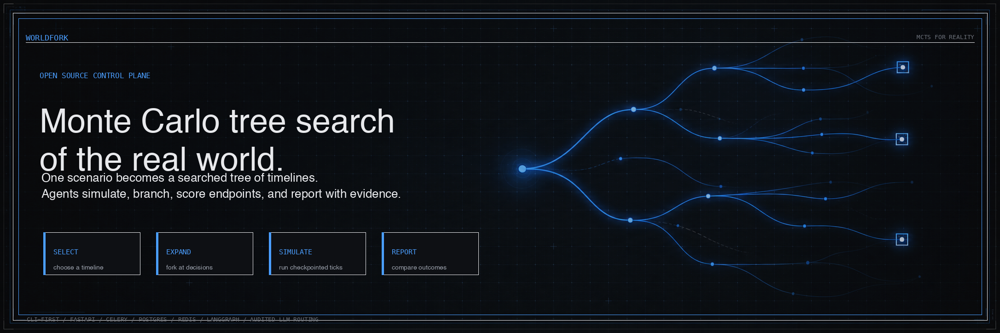
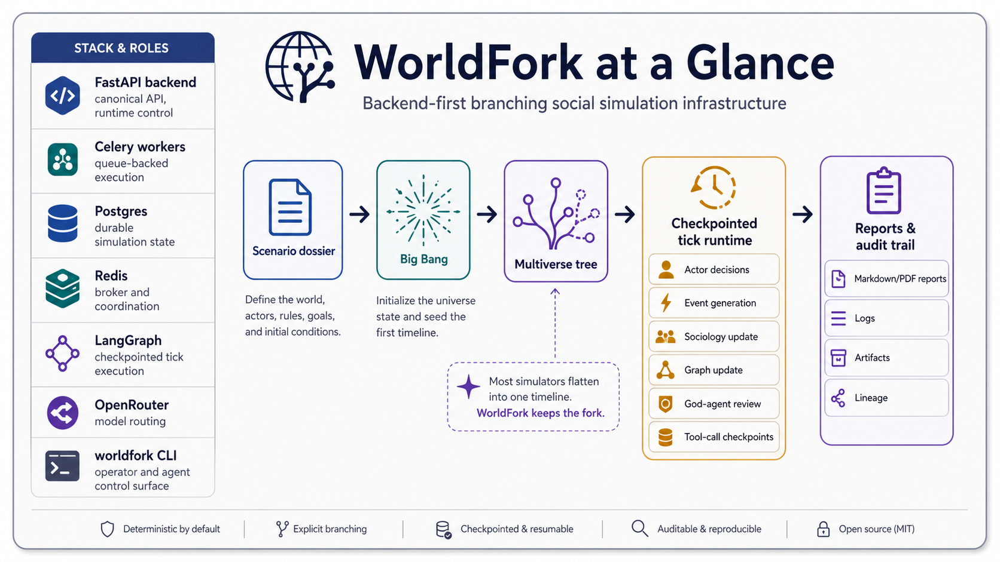
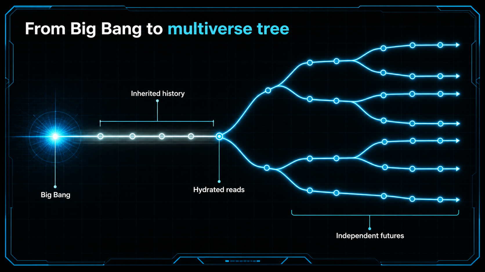
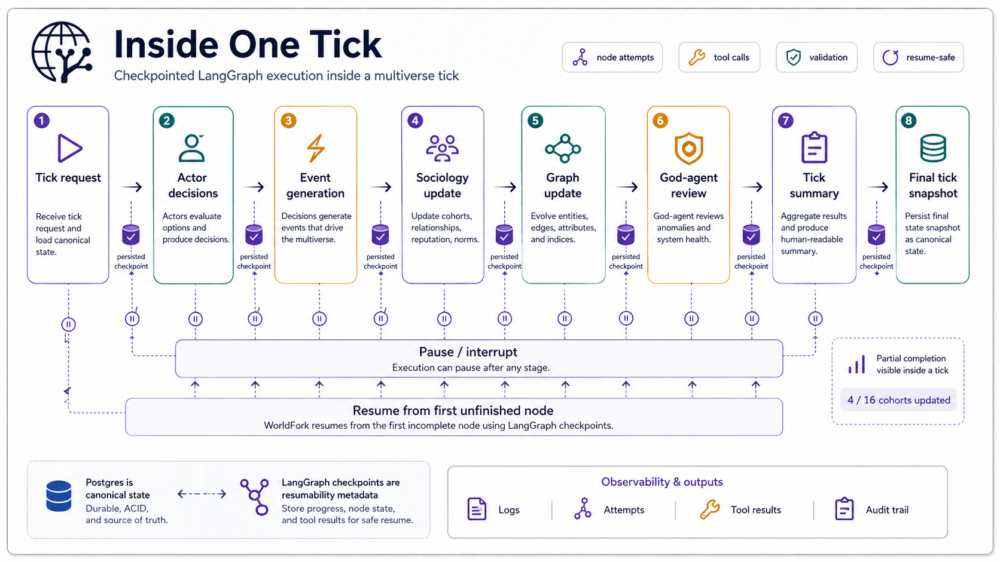
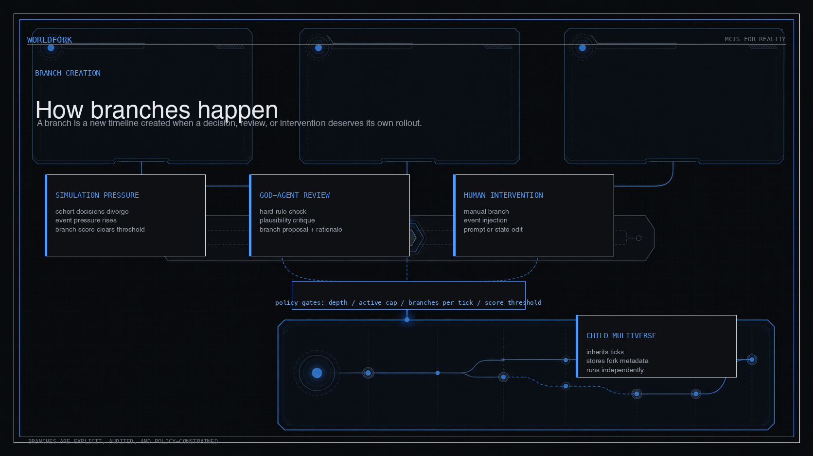
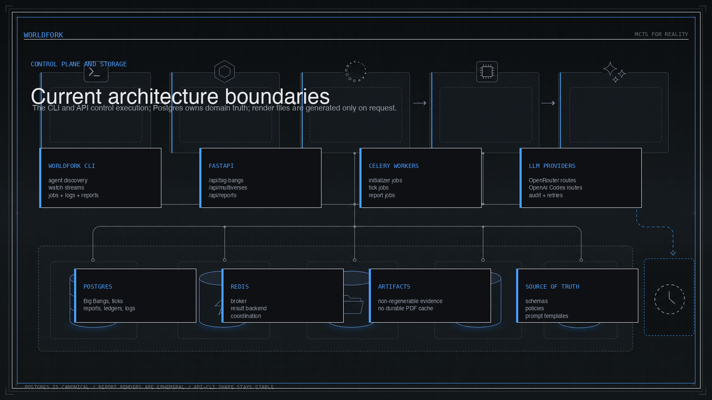

<div align="center">

# WorldFork

**Monte Carlo tree search of the real world: branching social simulation infrastructure for agents, operators, and auditable multiverse runs.**



[](https://www.python.org/) [](https://fastapi.tiangolo.com/) [](https://langchain-ai.github.io/langgraph/) [](https://openrouter.ai/) [](https://worldfork.readthedocs.io/en/latest/)

<p>
  <strong>Documentation:</strong>
  <a href="https://worldfork.readthedocs.io/en/latest/">Read the Docs</a>
  ·
  <a href="https://deepwiki.com/Hilo-Hilo/WorldFork">Deep Wiki</a>
</p>

WorldFork turns one scenario into many inspectable timelines.
Each run keeps the ticks, branches, agent reviews, manual interventions, logs, and final reports tied back to durable state.

</div>

---

## WorldFork at a Glance

<p align="center">
  
</p>

WorldFork is a **backend-first** and **CLI-first** system for exploring branching futures.
At the product level, it is a Monte Carlo tree search of the real world: start from a scenario, run simulated rollouts, branch when decisions matter, score terminal outcomes, and report the resulting distribution.
Start with a **Big Bang** scenario, execute a checkpointed tick runtime, allow both autonomous and human-created forks, then compare the resulting multiverses through structured reports.

### Why WorldFork?

Most simulations answer _"what happens next?"_ once.
WorldFork keeps asking that question across forks.

| You need to | WorldFork gives you |
| --- | --- |
| Explore alternative futures | Branching multiverses with lineage and inherited ticks |
| Audit what happened | Persisted runtime checkpoints, LLM calls, jobs, logs, and artifacts |
| Let agents operate safely | A compact `worldfork` CLI and `/api/agent/*` discovery surface |
| Compare outcomes | Versioned multiverse and final Big Bang reports |
| Keep live runs bounded | Queue controls, interruption, continuation, and runtime limits |

---

## Core Concepts

### 1) From Big Bang to Multiverse Tree

<p align="center">
  
</p>

A **Big Bang** is the root scenario.
It initializes the world state and seeds the first multiverse.
From there, WorldFork can create child multiverses at meaningful decision points while preserving lineage, inherited history, and auditable branch metadata.

Key ideas:
- A **Big Bang** creates the root timeline.
- The root timeline can fork into multiple child multiverses.
- Child multiverses inherit prior history up to the fork point.
- Branching is constrained by policy: depth, active multiverse cap, branches per tick, and score thresholds.
- Terminal or paused multiverses can later be **reported on** or **continued**.

### 2) Inside One Tick

<p align="center">
  
</p>

The canonical runtime is the **LangGraph-backed tick engine**.
Each tick is decomposed into observable, checkpointed stages so runs can be paused, resumed, inspected, or replayed safely.

The major stages are:
1. Tick request
2. Actor decisions
3. Event generation
4. Sociology update
5. Graph update
6. God-agent review
7. Tick summary
8. Final tick snapshot

Important runtime properties:
- **Checkpointed execution** with persisted nodes, attempts, and checkpoints.
- **Resume-safe tool calls** after interruption.
- **Partial progress visibility** inside a tick (for example `4 / 16 cohorts updated`).
- **Canonical durable state in Postgres**, with LangGraph checkpoints used as resumability metadata.
- **Auditable outputs** including logs, attempts, tool results, and tick summaries.

### 3) How Branches Happen

<p align="center">
  
</p>

WorldFork supports more than one kind of fork.
A branch can happen because the simulation naturally diverges, because the God-agent identifies a branch-worthy outcome, or because a human operator intentionally intervenes.

Branch sources include:
- **Model / simulation branch** — decision divergence, event pressure, or emergent behavior.
- **God-agent branch** — explicit review-driven branching.
- **Human operator branch** — manual intervention, event injection, prompt editing, forced branch creation from checkpoints, replaying nodes, or editing world state.

All of this is kept auditable through persisted prompt packets, raw and validated LLM outputs, tool I/O, human interventions, branch metadata, and undo history.

> Default reversibility model: human edits usually create a **branched multiverse** instead of mutating history in place.

### 4) Control Plane & Storage Boundaries

<p align="center">
  
</p>

WorldFork is intentionally backend-first.
The **`worldfork` CLI** is the stable control surface for operators and agents, while the backend owns execution, persistence, and reporting.

#### Runtime stack

| Layer | Responsibility |
| --- | --- |
| FastAPI | Canonical HTTP API and agent discovery |
| Celery | Queue-backed execution for long-running jobs |
| Postgres | Durable Big Bang, multiverse, tick, job, report, and log state |
| Redis | Broker, result backend, and coordination |
| LangGraph | Checkpointed tick graph execution |
| OpenRouter | LLM provider surface for the default low-cost cohort/hero/action routes |
| Artifact store | Durable JSON and audit payload files for non-regenerable evidence |
| `worldfork` CLI | Operator and AI-agent command surface |

Storage boundaries:
- **Postgres is canonical** for durable domain state.
- **Regenerable report renders are ephemeral**, generated only on request.
- **Reports are structured database records first**, then Markdown/PDF renderings when requested.
- Jobs can be **paused, resumed, interrupted, requeued, or run synchronously**.

---

## What Is In This Repo

WorldFork is a monorepo with installable and runnable surfaces around one core runtime:

| Surface | Location | Purpose |
| --- | --- | --- |
| Backend service | `backend/app` | FastAPI API, simulation runtime, jobs, storage, reports |
| CLI package | `cli/` | `worldfork` command for operators and agents |
| Agent skills | `skills/` | Setup, operator, report, and full-agent validation skills |
| Docs | `docs/` | Setup, architecture, demos, reporting, testing, and agent-facing guides |
| Examples | `examples/` | Runnable scenario dossiers and demos |
| Source of truth | `source_of_truth/` | Prompt, report, and policy templates |
| Scripts | `scripts/` | Local validation and demo harnesses |
| Infra | `infra/` | Docker and migration infrastructure |
| PRD | `prd.md` | Product requirements and architecture direction |

There is **no web frontend** in this repository.

---

## Setup

WorldFork supports both **agent-guided** and **manual** setup.

### Agent-guided setup (recommended)

Paste this prompt into your agent:

```text
Run this command to install the WorldFork setup skill, then use it to set up WorldFork:

npx skills add Hilo-Hilo/WorldFork/skills/worldfork-setup --all

Use the setup skill to preflight the machine, configure providers, verify the
stack, explain the core WorldFork concepts, use `worldfork setup` to compare
provider options, recommend the Atlas model split, and narrate live demos after
asking before API-credit use.
```

### Manual setup

#### Prerequisites

- Docker Desktop or another Docker Compose runtime
- Python 3.11+
- `uv`
- Node.js 20+ (for `npx skills`, if using skills)
- An OpenRouter API key and OpenAI Codex OAuth auth

#### Configure the environment

```bash
cp .env.example .env
```

Set `OPENROUTER_API_KEY` in `.env`.

Keep the default low-cost cohort/hero/action/event-summary model:

```text
deepseek/deepseek-v4-flash
```

Initializer, God-review, endpoint-ledger, and report routes default to `gpt-5.4` through the `openai-codex` provider.

Install the CLI:

```bash
python3.11 -m pip install -e ./cli
worldfork --help
```

Then configure OpenAI Codex OAuth so initializer, God-review, endpoint-ledger,
and report routes can use `openai-codex`:

```bash
worldfork settings openai-codex-login
```

The command writes the default auth file under `~/.worldfork/`; the backend also
accepts `OPENAI_CODEX_OAUTH_TOKEN` or `OPENAI_CODEX_AUTH_FILE` when an operator
needs a different auth location.

#### Start the stack

```bash
make build
make up
make migrate
make seed
```

#### Verify readiness

```bash
worldfork status
worldfork query GET /readyz --no-api-prefix
worldfork setup
```

A healthy local stack returns readiness checks for the database, Redis, OpenRouter, and optional Zep integration.
If readiness fails, first check Docker Desktop, port conflicts on `8003`, `5433`, or `6379`, and the effective LLM settings with `worldfork settings llm`.

`worldfork setup` gives agents a compact provider map and the recommended Atlas
routing profile: cheap/fast models for high-volume cohort/timeline work, and
stronger models for initialization, God review, endpoint-ledger, and reports.
It also shows local OpenAI-compatible options such as Ollama, vLLM, LM Studio,
and LocalAI, which can be routed to any audited agent type after a JSON-quality
smoke test.

#### Create and initialize a first Big Bang

```bash
worldfork init \
  --name "Atlas onboarding" \
  --scenario-file examples/test-big-bang.md \
  --max-ticks 4 \
  --tick-duration-minutes 720
```

This is a setup smoke for the initializer and workspace. Run the Atlas demo when
you want ticks, branching, reports, and endpoint-ledger behavior.

#### Inspect the initialized workspace

```bash
worldfork watch big-bang <big-bang-id> --once
worldfork runs workspace <big-bang-id>
worldfork logs list --status failed
```

Run the larger onboarding demo when you want the full branch-and-report showcase:

```bash
worldfork demo atlas
```

After a demo or completed simulation, inspect structured reports before
rendering files:

```bash
worldfork reports list <big-bang-id>
worldfork reports view <report-version-id>
worldfork reports render <report-version-id> --format pdf --output report.pdf
```

---

## Core Commands

| Command | Use it for |
| --- | --- |
| `worldfork status` | Backend and queue health |
| `worldfork agent discover` | Agent-facing API contract and recommended flow |
| `worldfork init ...` | Create a Big Bang and wait for initialized state |
| `worldfork watch big-bang <big-bang-id>` | Stream run activity until completion |
| `worldfork watch multiverse <multiverse-id>` | Stream one timeline's ticks and logs |
| `worldfork runs list` | Find recent Big Bangs |
| `worldfork runs workspace <big-bang-id>` | Inspect one run's workspace |
| `worldfork jobs list --status failed` | Inspect queue failures |
| `worldfork logs list --status failed` | Inspect failed logs |
| `worldfork settings show` | Read mutable runtime settings |
| `worldfork update` | Pull latest code without touching local config/data |
| `worldfork reports view <report-version-id>` | View a report version as Markdown |
| `worldfork smoke live` | Run the full live runtime smoke test |
| `worldfork demo atlas` | Run the full Atlas onboarding demo |

Use global flags **before** the command:

```bash
worldfork --verbosity summary runs list
worldfork --fields id,status,created_at jobs list
worldfork --json status
```

---

## Documentation

| Guide | What it covers |
| --- | --- |
| [Setup](docs/setup.md) | Local environment, Docker stack, CLI, skill install |
| [CLI](docs/cli.md) | Command reference and agent-safe usage patterns |
| [Architecture](docs/architecture.md) | Runtime model, storage layers, jobs, reports |
| [Demos](docs/demos.md) | Atlas onboarding, live smoke, expected outputs |
| [Reporting](docs/reporting.md) | Report versions, artifacts, continuation semantics |
| [Agent Interface](docs/agent.md) | Rules and examples for AI agents operating WorldFork |
| [Testing](docs/testing.md) | Maintained validation commands and live smoke scope |
| [Backend Notes](backend/README.md) | Backend package and API details |

---

## Project Layout

```text
backend/app/          FastAPI app, runtime, jobs, storage, reports
backend/tests/        root regressions, unit, integration, and e2e tests
cli/                  standalone Python CLI package
skills/               installable agent skills
examples/             runnable scenario dossiers
source_of_truth/      prompt, report, and policy templates
scripts/              local validation and demo harnesses
infra/                Docker and Alembic infrastructure
docs/                 operator and agent documentation
prd.md                product requirements source
```

---

## Status

WorldFork is **backend-first** and **CLI-first**.
The current system is Dockerized, tested across unit/integration/e2e layers, and live-smoke validated against the default model split:

```text
openrouter/deepseek/deepseek-v4-flash
openai-codex/gpt-5.4
```

If you want to understand the project quickly, start with the diagrams above, then run:

```bash
worldfork agent discover
worldfork status
```

## License

WorldFork is licensed under the Apache License, Version 2.0. See [LICENSE](LICENSE) and [NOTICE](NOTICE).
