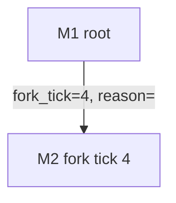

# WorldFork Report

Use this skill when acting as an external report author for WorldFork. The job is to operate the real `worldfork` CLI, gather evidence across the simulated search tree, prune low-value detail, and produce a cited cross-multiverse report. This is separate from the backend report agent, which generates structured report versions inside the service.

## Ground Rules

- Use the `worldfork` CLI as the control surface. Do not hardcode backend URLs; use the CLI default, `--base-url`, `WORLD_FORK_API_BASE`, or `BACKEND_API_BASE`.
- Put global flags before the command: `worldfork --verbosity summary runs workspace <big-bang-id>`.
- Start with `--verbosity summary`; switch to `normal`, `full`, or direct JSON only when a specific evidence gap needs it.
- Treat reports as structured database records first. Markdown/PDF outputs are ephemeral renders for a report version.
- Prefer read-only inspection. Generate missing reports only when the user asked for a report or the target timelines are terminal and report generation is the natural next step.
- Use bounded waits for jobs. Do not run unbounded polling loops.
- Do not run new ticks, continue timelines, or change runtime settings unless the user explicitly asks.
- For live API-credit work, use the current effective route policy. The default is `openrouter/deepseek/deepseek-v4-flash` for cohort, hero, action, and event-summary work and `openai-codex/gpt-5.4` for initialization, God review, endpoint-ledger evaluation, and reports unless the user explicitly authorizes another model.

## Workflow

1. Discover the active surface and health:

```bash
worldfork agent discover
worldfork status
worldfork models defaults
worldfork settings llm
```

2. Identify the Big Bang and workspace:

```bash
worldfork --verbosity summary runs list
worldfork --verbosity summary runs workspace <big-bang-id>
worldfork watch big-bang <big-bang-id> --once
```

Use `--fields` on large rows when only IDs, labels, statuses, report states, or tick indexes are needed.

3. Inventory reports:

```bash
worldfork reports list <big-bang-id>
worldfork reports pack <big-bang-id> --mode summary
worldfork reports adjudication <big-bang-id>
worldfork reports versions <report-id>
worldfork reports view <report-version-id> --format json
worldfork reports view <report-version-id>
```

Start from `reports pack --mode summary`; it is the canonical compact evidence pack for cross-timeline report writing. If no adjudication exists yet and the timelines are terminal, run `worldfork reports adjudicate <big-bang-id>` once, then inspect `worldfork reports adjudication <big-bang-id>`. Select the latest version for each logical multiverse report and the latest `final_big_bang` report unless the user asks for a specific historical version.

## Report Model Routing

Before generating or regenerating reports, inspect effective routing:

```bash
worldfork settings llm
worldfork settings model-routing
worldfork --verbosity normal --fields id,source,status,message,provider,model,big_bang_id logs list --source llm
```

If the user asks for a higher-quality report, configure only the report-related routes unless they ask for broader simulation changes. `report_agent`, `endpoint_ledger`, and `god_agent` are the routes most relevant to report quality and outcome review. `cohort_agent` can stay on a cheaper model because report generation should not normally create new cohort decisions.

Example route patch for a Codex-backed report agent:

```bash
worldfork settings model-routing --data '{
  "entries": [
    {
      "job_type": "report_agent",
      "preferred_provider": "openai-codex",
      "preferred_model": "gpt-5.4",
      "fallback_provider": "openai-codex",
      "fallback_model": "gpt-5.4",
      "temperature": 0.25,
      "top_p": 1.0,
      "max_tokens": 8192,
      "max_concurrency": 2,
      "requests_per_minute": 20,
      "tokens_per_minute": 200000,
      "timeout_seconds": 300,
      "retry_policy": "exponential_backoff",
      "payload": {}
    }
  ]
}'
worldfork settings llm
```

After report generation, verify the stored report metadata and LLM audit logs show the expected provider/model. Restore previous route rows if the model change was only for a temporary report pass.

4. Generate missing backend reports when appropriate:

```bash
worldfork reports generate multiverse <multiverse-id> --title "<title>" --summary "<summary>"
worldfork reports generate final <big-bang-id> --title "<title>" --summary "<summary>"
```

Only generate the final Big Bang report after relevant multiverses are terminal. If a mutation returns a job ID, run `worldfork jobs wait <job-id> --timeout 300 --poll-interval 2`.

5. Collect supporting evidence:

```bash
worldfork --verbosity normal runs workspace <big-bang-id>
worldfork watch multiverse <multiverse-id> --once
worldfork universes trace <multiverse-id>
worldfork cohorts transcript <cohort-id> --universe-id <multiverse-id>
worldfork logs list --status failed
worldfork jobs list --status failed
```

Use direct `worldfork query` only when a first-class command is missing. Keep API paths canonical, for example `/api/big-bangs`, `/api/multiverses`, `/api/ticks`, `/api/reports`, and `/api/agent/*`.

## Report Workspace

Create a local report workspace when the task needs files, charts, or repeatable artifacts:

```text
reports/worldfork-report-<big-bang-id>/
  evidence/
  charts/
  report.md
  report.tex
  metrics.csv
```

Use Markdown as the default authoring format. Add LaTeX only when the user asks for it or the final deliverable benefits from print-quality formatting. Render PDF through `worldfork reports render --output <file>` when using a backend report version; use a local Markdown/LaTeX toolchain only for the external synthesized report.

## What To Extract

For each multiverse, capture:

- `multiverse_id`, label, status, report status, version, parent, fork tick, branch depth, and latest tick.
- Terminal outcome or current unresolved state.
- Branch score trend, God-agent decisions, key rationales, and rejected branch candidates when available.
- Cohort and hero state changes that materially affect the outcome.
- Important social posts, graph/trust/exposure/dependency changes, and event traces.
- Evidence IDs: report version IDs, tick IDs, lineage refs, job IDs, log IDs, artifact IDs.

For the Big Bang comparison, capture:

- Lineage tree and fork reasons.
- Endpoint ledger histogram, terminality assessment, contradiction check, and status basis.
- Timeline adjudication: retained/pruned timelines, original path probability, effective path probability, excluded mass, and prune reason.
- Outcome distribution across terminal timelines using effective path mass when adjudication exists.
- Recurring causal mechanisms and divergence drivers.
- Which branch looks like the likely endpoint, and why.
- Evidence gaps, failed jobs, missing reports, or non-terminal timelines.

## Pruning Rules

- Treat timeline adjudication as the first pruning ledger. It changes report inclusion/effective path mass, not the underlying simulation data.
- Retain timelines marked `include_in_final=true`; summarize pruned timelines only when their prune reason affects confidence, quality, or user decisions.
- Do not multiply or invent endpoint probabilities yourself when an endpoint ledger exists. Use the ledger histogram and path-probability distribution, and explain that effective path probabilities are renormalized across retained timelines.
- Keep causal evidence; drop repeated raw bundles, full transcript dumps, duplicated inherited ticks, and rows that do not change the conclusion.
- Summarize per-tick detail into phases unless a specific tick caused a branch, state transition, terminal decision, or report conclusion.
- Prefer tables for multiverse comparisons and bullet lists for evidence gaps.
- Quote sparingly. Use IDs and command outputs as traceability instead of pasting entire JSON payloads.
- If evidence conflicts, name the conflict and preserve both source IDs.
- If data is missing, say what is missing and which command or endpoint was checked.
- Escalate from `reports pack --mode summary` to `standard`, then `full`, only for missing causal detail. Avoid dumping raw ticks or transcripts into the prompt.

## Visuals

Add visuals only when they clarify comparison:

- Use Mermaid for lineage trees in Markdown.
- Use CSV plus a local plotting tool for branch score, tick counts, report statuses, and outcome distributions.
- Store generated images under `charts/` and reference them from the report.
- Keep chart inputs in `metrics.csv` or JSON so the chart can be regenerated.

Example Mermaid lineage block:



## Output Shape

A strong report has:

1. Executive summary: final answer, likely endpoint, and confidence/evidence gaps.
2. Big Bang context: scenario, horizon, tick limits, model/routing if relevant.
3. Multiverse comparison table.
4. Lineage and divergence analysis.
5. Timeline adjudication and pruning ledger.
6. Timeline summaries for each important retained branch, with pruned branches summarized separately.
7. Endpoint distribution and charts when useful.
8. Evidence appendix with report/tick/job/log/artifact IDs.

When answering in chat, compress this structure to the user’s requested level of detail and include only the highest-signal evidence.
